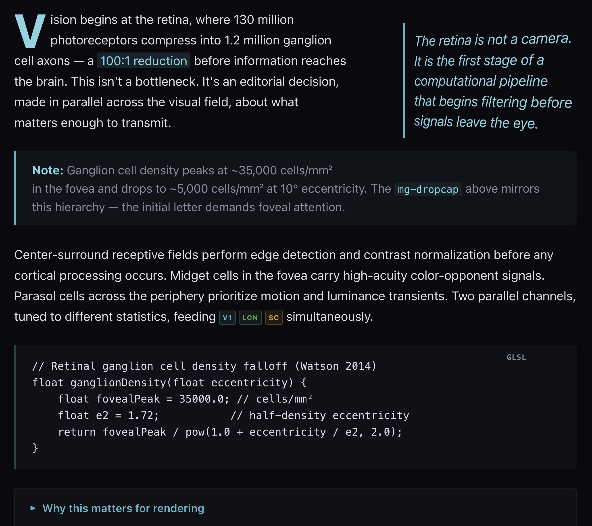

# Marginalia

Typographic callout library. 7 components, CSS custom properties, zero dependencies.

Extracted from [Inside the Math](https://andyed.github.io/psychodeli-webgl-port/inside_the_math/) and [Scrutinizer](https://andyed.github.io/scrutinizer-www/) blog posts.



**[Live Demo & Documentation](https://andyed.github.io/marginalia/)**

## Install

```html
<link rel="stylesheet" href="marginalia.css">
<script src="marginalia.js" defer></script>
```

JS is optional. All components work without it.

## Components

| Component | Element | Key feature |
|-----------|---------|-------------|
| Callout | `<div class="mg-callout" data-type="note">` | 4 semantic variants, left-border indicator |
| Pull quote | `<aside class="mg-pull">` | 3D perspective tilt, `shape-outside` text wrapping |
| Code block | `<pre class="mg-code" data-lang="js">` | Language label, copy button (JS) |
| Badge | `<span class="mg-badge">` | Small caps, inline label |
| Collapse | `<details class="mg-collapse">` | Native `<details>`, smooth animation (JS) |
| Highlight | `<mark class="mg-mark">` | Theme-aware inline highlight |
| Drop Cap | `<p class="mg-dropcap">` | `::first-letter` large initial, ornate variant |

## Usage Examples

```html
<!-- Drop cap -->
<p class="mg-dropcap">Your opening paragraph.</p>
<p class="mg-dropcap" data-type="ornate">Ornate variant with border accent.</p>
```

## Theming

Dark by default. Override via CSS custom properties (`--mg-*`). Light theme via `data-mg-theme="light"` or `prefers-color-scheme`.

## License

MIT
